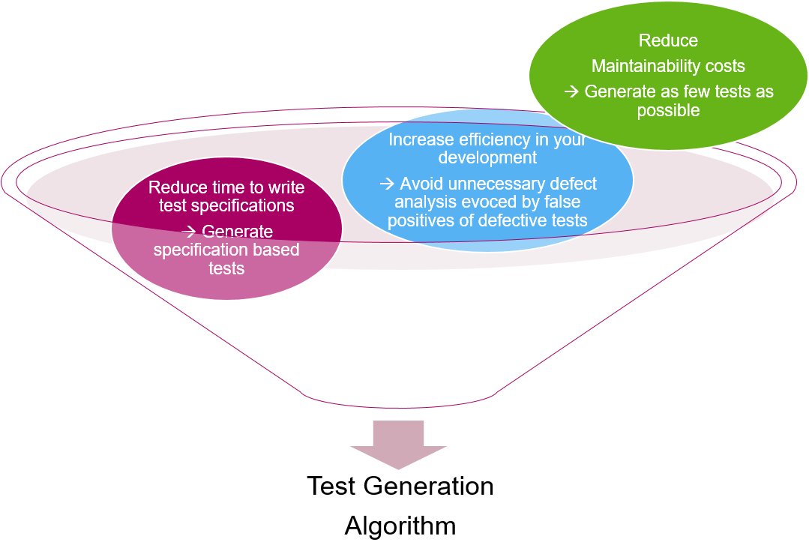

# What is Hanfor?
**Hanfor** **h**elps **an**alyzing **an**d **for**malizing **r**equirements.

If you have many requirements it gets difficult to check that all of them are, e.g., consistent. No human can manually check >1000 requirements for consistency -- so we do our best with reviews.

Also in new projects, what we often see, is that it takes a long time before there is a high test coverage on the requirements -- as the number of requirements increases over the releases, and thus also the test specifications have to cover more and more requirements. However, many defects are found by experience-based testing -- but these technique is often used quite late, as the first priority is to get a reasonable requirement-based coverage.

To tackle that problem, Hanfor provides a method that consists of 3 steps:

1. The Requirements Formalization
2. The Requirements Check (on the formalized requirements)
3. The Test Generation (on the formalized requirements)


To make it possible for a computer to check a set of requirements for quality criteria, as e.g. consistency, it has to "understand" the semantics of the requirements.

This could be achieved by using formal languages to express the requirements. However, they are rarely understandable for humans, so we would get requirements that the computer understands - but nearly no stakeholder.

In this method we use a simple pattern language. The requirements expressed in the pattern language look like English sentences. Everything you can express in this patterns is then translated in the background into logical formulas. You could also easily translate them into German, Chinese, or other languages.

### Grammar of the Specification Language
The grammar is the following:
````
REQ      ::= ID: SCOPE, PATTERN .
SCOPE    ::= Globally  | Before EXPR  | After EXPR | Between EXPR and EXPR  | After EXPR until EXPR
PATTERN  ::= It is never the case that EXPR holds
           | It is always the case that EXPR holds
           | It is always the case that if EXPR holds, then EXPR holds as well
           | Transition to states in which EXPR holds occur at most twice
           | It is always the case that ORDER
           | It is always the case that REALTIME
ORDER    ::=
           | If EXPR holds, then EXPR previously held
           | If EXPR holds and is succeded by EXPR, then EXPR previously held
           | If EXPR holds, then EXPR previously held and was preceeded by EXPR
           | If EXPR holds, then EXPR eventually holds and is succeeded by EXPR
           | If EXPR holds and is succeeded by EXPR, then EXPR eventually holds after EXPR
           | If EXPR holds, then EXPR eventually holds and is succeeded by EXPR where EXPR does not hold between EXPR and EXPR
           | If EXPR holds, then EXPR toggles EXPR
REALTIME ::= Once EXPR becomes satisfied, it holds for at least DURATION
           | Once EXPR becomes satisfied, it holds for less than DURATION
           | EXPR holds at least every DURATION
           | If EXPR holds, then EXPR holds after at most DURATION
           | If EXPR holds for at least DURATION, then EXPR holds afterwards for at least DURATION
           | If EXPR holds for at least DURATION, then EXPR holds afterwards
           | If EXPR holds, then EXPR holds after at most DURATION for at least DURATION
           | If EXPR holds, then EXPR holds for at least DURATION
           | If EXPR holds, then there is at least one execution sequence such that EXPR holds after at most DURATION
           | After EXPR holds for DURATION, then EXPR holds
           | If EXPR holds, then EXPR toggles EXPR at most DURATION later
````
``EXPR`` is an expression (e.g. ``vehicleSpeed<10 && Terminal15==ON``).

Thus, in a first step the informal requirements are translated into requirements in the specification language shown above. This is done manually.

In the background the tool translates the requirements in specification language then into logical formulas.


### Tool Support
The tool to assist this step is called Hanfor.It looks a little bit like Doors. It takes as input a csv-Export from Doors, and then stores the requirements. There are two IDs, the Hanfor ID and the Doors ID, so that you can synchronize the two databases, and can easily identify changes.


Clicking on a requirements you can then specify the requirement in the specification language as visible in the next screenshot. The tool provides both patterns and also a signal database, so that you have a auto-complete function when filling out the variables.


The tool checks for the following correctness criteria: 
  
  * Consistency
  * Vacuity
  * rt-Consistency


#### Consistency
A set of requirements is inconsistent, if there exists no system satisfying all requirements in the set.
!!! example 
    * ``Req1: It is always the case that "IRTest" holds.``
    * ``Req2: It is never the case that "IRTest" holds.``


Inconsistency can be resolved by  

  * erasing requirements 
  * changing requirements


#### Vacuity
A set if requirements is vacuous, if there is no system satisfying all requirements in a meaningful way, i.e., there are "dead" requirements.
!!! example
 * ``Req1: It is always the case that if "Signal-A" holds then "Signal-B" holds after at most 10 ms.``
 * ``Req2: It is never the case that "Signal-A" holds.``

These requirements are consistent, **but** the precondition of ``Req1`` is never true, i.e., ``Req1`` is vacuously satisfied in this set of requirements. 

Vacuity can be resolved by 

  * erasing requirements, or
  * changing requirements

!!! example
    * Erase ``Req2`` or make it less restrictive
    * Change ``Req2`` to ``Req2': Before "Startup", it is never the case that "Signal-A" holds.``


#### Realtime-Consistency (rt-consistency)
A set of requirements is rt-inconsistent, if there are conflicts between requirements that arise after a certain time.

!!! example
    * ``Req1: It is always the case that if „IRTest“ holds, then „IRLampsOn“ holds after at most 10 seconds``
    * ``Req2: It is always the case that if „IRTest“ holds, then „NOT(IRLampsOn)“ holds for at least 6 seconds.``


is consistent, **but** there are assignments with a conflict as shown in the following example.


As IRTest gets valid in timepoint t=4, req1 requires, that in the time interval ``t=[4...14]`` ``IRLampsOn`` gets true as well.

As IRTest is still valid in timepoint t=10, req2 requires, that IRLampsOn stays "false" until at least t=16. Thus, in t=14 we have a conflict - however the system reacts, one requirement will be violated.

Resolve rt-inconsistency by

  * erasing requirements, or
  * changing requirements, or
  * adding requirements

Erase Req2, or make it less restrictive
–Req2‘: It is always the case that if IRTest holds and it did not hold in the last 10 s, then NOT(IRLampsOn) holds for at least 6 s.

Or add
Req3: Once IRTest appears, it holds for at most 3 seconds.

Req4: Once IRTest disappears, it is absent for at least 10 seconds


### System test case generation
When having the requirements formalized in the specification language, it makes sense to also automatically generate test specifications out of them.
There are several reasons to do so:



Thus the algorithm has to:

  * Automatically generate system tests only using requirements
  * Generate small set of tests (test suite)
    * Generate one test case per output variable
    * Generate so many tests that every requirement is tested
  * Generate tests that may not lead to false positives
  * Ensure traceability to the requirements (i.e. indicate what requirements are tested by the test)

  * The generated Test (case) consists of
    * Sequence of inputs (Initial state of system, Inputs for steps 1...n)
    * Expected outcome (oracle for step n)
    * Link to the tested requirement
  * Generate a feedback if there are untestable requirements
    * Output: Set of untestable requirements

(No seq. of Inputs deterministically causes the output)


!!! example "Requirements to be tested"
    * ``req1: Globally, it is always the case that if ‘A’ holds then ‘H’ holds after at most ‘10’ time units.``
    * ``req2: Globally, it is always the case that if ‘B’ holds then ‘I’ holds after at most ‘10’ time units.``
    * ``req3: Globally, it is always the case that if ‘H AND I’ holds then ‘O’ holds after at most ‘10’ time units.``

Testing requires information about observability. Thus, we need to categorize the variables into Input, Output, and Hidden (i.e. internal variables):

  * Inputs: A, B
  * Outputs: O
  * Hidden: H, I

In the Test Generator Tool you can choose the following options:

  * generate System Test (i.e. the tests only speak about system inputs and outputs, but no internal variables)
  * generate System Integration Test (i.e., the tests speak about system input, system outputs and internal variables)

!!! example "output of the test generation tool"
  ```
    Case SystemTest:
    TestGeneratorResult:
    Found Test for: [O]
    Test Vector:
    Set inputs:
    A := true, B := true
    Wait for at most 20 for:
    O == true, (req3)
    
    Case System Integration Test:
    ------| Test: req3 |-----------------------
    TestGeneratorResult:
    Found Test for: [O]
    Test Vector:
    Set inputs:
    A := true, B := true
    Wait for at most 10 for:
    H == true (req1)
    Wait for at most 10 for:
    I == true (req2)
    Wait for at most 20 for:
    O == true, (req3)
  ```