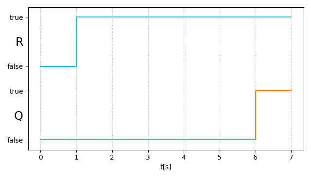

toc_depth: 4

# Phase Event Automata

A phase event automaton (PEA) is a special automaton that allows to measure time. In Hanfor, PEAs are used to model the requirements that are already translated into [DC-Counterexample Formulae](../references/duration_calculus.md#counterexample-formulas "Counterexample Formulae"). PEAs are used as an intermediate step between the formalized requirements and the requirements check respectively test generation procedure. In this documentation, we included the PEA representation of the available patterns as it often helps to get a more precise idea of what the exact meaning of a pattern is. Although a restricted english grammar is used to express requirements, it may happen that people have different interpretations of one and the same requirement. The PEA representation of a requirement however is unambiguous.

This short guide should give you an intuitive understanding of how to interpret the phase event automata given in the [pattern](../references/patterns.md "Available Patterns") section of this documentation. If you are interested in a formal description of phase event automata, please refer to our paper "[Scalable Analysis of Real-Time Requirements](../references/publications/scalable-analysis.pdf "Formal Description PEA")".


## Representation of PEAs

Figure 1 shows a phase event automaton representing the following requirement:

```
req1: Globally, it is always the case that if "R" holds for at least "5" time units, then "Q" holds afterwards.
```

<figure markdown="span">
  { loading=lazy }
  <figcaption>Figure 1: Phase event automaton modeling requirement *req1*.</figcaption>
</figure>

First we will have a look at the different components that are used to depict a PEA. 

**Variables:**<br>
The variables and time constants that occur in the PEA are directly coming from the corresponding requirement. *req1* contains two boolean variables, namely "R" and "Q", and the timing constant "5". Each timing constant is related to a unique clock variable. The timing constant and its corresponding clock variable can be found in the PEA as a boolean time constraint, e.g. "c0<5".
The boolean variables can occur as unprimed variables (e.g. Q) and primed variables (e.g. Q'). Unprimed variables are related to the current point in time whereas primed variables are related to a point in time in the future.

**Phases:**<br>
The PEA consists of locations or phases, and edges representing transistions between the phases.
Each phase of the PEA consists of a unique name, a phase invariant and a clock invariant. E.g. consider the PEA phase given in Figure 2. The name is "st01W", the phase invariant is given by the expression "R" and the clock invariant by the time constraint "c0<=5". If a phase has an incoming edge that has no source, we call it "initial".

<figure markdown="span">
  { loading=lazy }
  <figcaption>Figure 2: Exemplary phase of a PEA defined by its name, phase invariant, and clock invariant.</figcaption>
</figure>

**Transitions:**<br>
Each transition between phases is labeled with a boolean expression called "guard" and may additionally carry a clock reset statement. The guard may contain primed and unprimed variables as well as timing constraints. A transition from one phase to another can only be taken if the guarding expression is satisfied: This means that the guarding expression must evaluate to *true* under the current valuation (for unprimed variables and the clock constraint) together with the subsequent valuation (for the primed variables). If there is no constraint the guard is trivially satisfied and hence set to *true*.

## Run of a PEA

Next we want to be able to describe the behavior that is (not) included in a PEA. Other than most types of automata, a PEA has no explicit acceptance condition. 

A **configuration** of a PEA contains a location, a valuation of the variables and clocks, and a duration.

A **run** of a PEA is a sequence of configurations such that the following conditions are satisfied:
    
  * The location of the first configuration is initial.
  * In each configuration, the valuation of variables fulfils the phase invariant of the corresponding location. 
  * In each configuration, the valuation of clocks and the clocks increased by the duration fulfils the clock invariant of the corresponding location.
  * For every pair of consecutive configurations, there is an edge from the location of the predecessor configuration to the location of the consecutive configuration such that the guard is fulfilled. 


!!! example "Example 1: Configurations of a PEA"
	Consider the PEA for *req1* (Figure 1). It contains the variables "R, Q", the clock variable "c0", and the locations "st0, st01W, st01".

	Below you find some **configurations** of the given PEA:

	* (st0, {R=*true*, Q=*false*}, {c0=2}, 2)
	* (st01W, {R=*true*, Q=*true*}, {c0=4}, 6)
	* (st01, {R=*false*, Q=*true*}, {c0=7}, 3)

	
!!! example "Example 2: Run of a PEA"
	Consider the PEA for *req1* (Figure 1). It contains the variables "R, Q", the clock variable "c0", and the locations "st0, st01W, st01". The following sequence of three configurations describes a **run** of the given PEA:
	<p style="text-align: center;">
	(st0, {R=*false*, Q=*false*}, {c0=0}, 1);<br>
	(st01W, {R=*true*, Q=*false*}, {c0=0}, 5);<br>
	(st01, {R=*true*, Q=*true*}, {c0=5}, 2)
	</p>
	
	Let us check whether the conditions for a run are satisfied for all configurations in the sequence:

	**1. Configuration:**

	  * The location "st0" is initial as it has an incoming edge without source. 
	  * The phase invariant "!R" is fulfilled by the valuation "R=*false*". 
	  * The clock invariant *true* cannot be violated. 
	  * There is an edge from location "st0" to location "st01W" of the second configuration. The guard is *true* and can not be violated.
		

	**2. Configuration:**

	  * The phase invariant "R" is fulfilled by the valuation "R=*true*". 
	  * The clock invariant "c0<=5" is fulfilled by the clock valuation "c0=0" (as the clock was reset) and also holds for the entire duration of "5". 
	  * There is an edge from location "st01W" to location "st01" of the third configuration with the guarding expression "c0>=5". The guard is fulfilled by the clock valuation increased by the duration.

	**3. Configuration:**

	  * The phase invariant "Q && R" is fulfilled by the valuation "R=*true*, Q=*true*".
	  * The clock invariant is "*true*" and hence trivially satisfied.
	

!!! example "Example 3: Not-included Run of a PEA"
	Consider the PEA for *req1* (Figure 1). It contains the variables "R, Q", the clock variable "c0", and the locations "st0, st01W, st01". The following sequence of two configurations is not included in the given PEA:
	<p style="text-align: center;">
	(st01W, {R=*true*, Q=*true*}, {c0=2}, 3);<br>
	(st01, {R=*true*, Q=*false*}, {c0=7}, 32)
	</p>
	
	Let us check whether the conditions for a run are satisfied for all configurations in the sequence:

	**1. Configuration:**

	  * The location "st01W" is initial as it has an incoming edge without source. 
	  * The phase invariant "R" is fulfilled by the valuation "R=*true*". 
	  * The clock invariant "c0<=5" is fulfilled by the clock valuation "c0=2" and also holds for the entire duration of "3".
	  * There is an edge from location "st01W" to the location "st01" of the second configuration with the guarding expression "c0>=5". The guard is fulfilled by the clock valuation increased by the duration.

	**2. Configuration:**

	  * The phase invariant "Q && R" is **violated** by the valuation "Q=*false*". 
	  * The clock invariant is "*true*" and hence trivially satisfied.

	As the phase invariant condition is violated in the second configuration, the given sequence is not included in the given PEA.


## Timing Diagram
As the tupel representation of a run is not necessarily intuitive, we often depict a run in form of a timing diagram. Below you find the timing diagram representation of the run described in Example 1. 

<figure markdown="span">
  { loading=lazy }
  <figcaption>Figure 3: Timing diagram representation of a run included in the PEA of *req1*.</figcaption>
</figure>