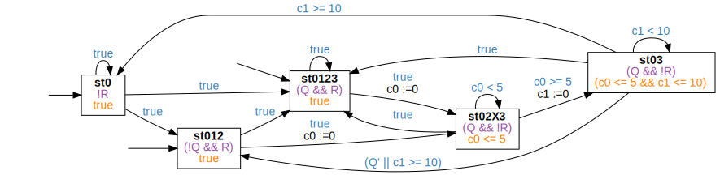

<!-- Auto generated file, do not make any changes here. -->

## BndDelayedResponsePatternUT

### BndDelayedResponsePatternUT Globally
```
Globally, it is always the case that if "R" holds, then "Q" holds after at most "5" time units for at least "10" time units
```
```
Counterexample: true;⌈R⌉;⌈true⌉ ∧ ℓ ≤ 5;⌈Q⌉ ∧ ℓ < 10;⌈!Q⌉;true
```

