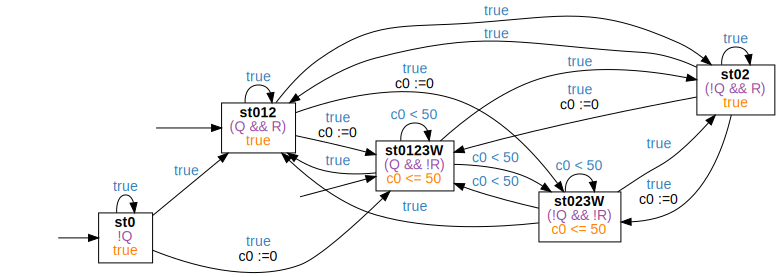

<!-- Auto generated file, do not make any changes here. -->

## BndReccurrencePattern

### BndReccurrencePattern Globally
```
Globally, it is always the case that "Q" holds at least every "5" time units
```
```
true;⌈!Q⌉ ∧ ℓ > 10;true
```

### BndReccurrencePattern Before
```
Before "Q", it is always the case that "R" holds at least every "5" time units
```
```
⌈!Q⌉;⌈(!Q && !R)⌉ ∧ ℓ > 5;true
```

### BndReccurrencePattern After
```
After "Q", it is always the case that "R" holds at least every "5" time units
```
```
true;⌈Q⌉;true;⌈!R⌉ ∧ ℓ > 5;true
```

### BndReccurrencePattern Between
```
Between "Q" and "R", it is always the case that "S" holds at least every "5" time units
```
```
true;⌈(Q && !R)⌉;⌈!R⌉;⌈(!R && !S)⌉ ∧ ℓ > 5;⌈!R⌉;⌈R⌉;true
```

### BndReccurrencePattern AfterUntil
```
After "Q" until "R", it is always the case that "S" holds at least every "5" time units
```
```
true;⌈(Q && !R)⌉;⌈!R⌉;⌈(!R && !S)⌉ ∧ ℓ > 5;true
```

