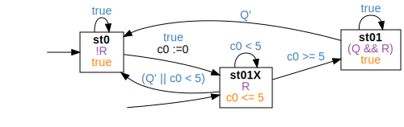

<!-- Auto generated file, do not make any changes here. -->

## BndResponsePatternTU

### BndResponsePatternTU Globally
```
Globally, it is always the case that if "R" holds for at least "5" time units, then "Q" holds afterwards
```
```
true;⌈R⌉ ∧ ℓ ≥ 5;⌈!Q⌉;true
```

