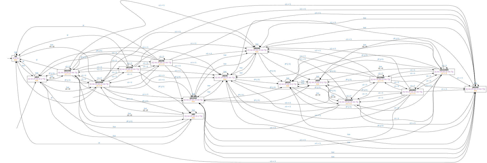

<!-- Auto generated file, do not make any changes here. -->

## BndResponsePatternUT

### BndResponsePatternUT Globally
```
Globally, it is always the case that if "R" holds, then "Q" holds after at most "5" time units
```
```
Counterexample: true;⌈(!Q && R)⌉;⌈!Q⌉ ∧ ℓ > 5;true
```

### BndResponsePatternUT Before
```
Before "Q", it is always the case that if "S" holds, then "R" holds after at most "5" time units
```
```
Counterexample: ⌈!Q⌉;⌈(!Q && (!R && S))⌉;⌈(!Q && !R)⌉ ∧ ℓ ≥ 5;true
```

### BndResponsePatternUT After
```
After "Q", it is always the case that if "S" holds, then "R" holds after at most "5" time units
```
```
Counterexample: true;⌈Q⌉;true;⌈(!R && S)⌉;⌈!R⌉ ∧ ℓ ≥ 5;true
```

### BndResponsePatternUT Between
```
Between "Q" and "R", it is always the case that if "T" holds, then "S" holds after at most "5" time units
```
```
Counterexample: true;⌈(Q && !R)⌉;⌈!R⌉;⌈(!R && (!S && T))⌉;⌈(!R && !S)⌉ ∧ ℓ ≥ 5;⌈!R⌉;⌈R⌉;true
```

### BndResponsePatternUT AfterUntil
```
After "Q" until "R", it is always the case that if "T" holds, then "S" holds after at most "5" time units
```
```
Counterexample: true;⌈(Q && !R)⌉;⌈!R⌉;⌈(!R && (!S && T))⌉;⌈(!R && !S)⌉ ∧ ℓ ≥ 5;true
```

