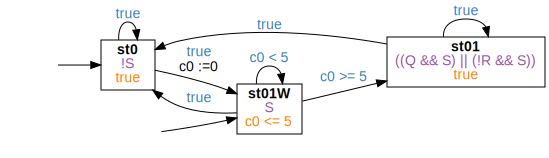

<!-- Auto generated file, do not make any changes here. -->

## BndTriggeredEntryConditionPattern

### BndTriggeredEntryConditionPattern Globally
```
Globally, it is always the case that after "S" holds for at least"5" time units and"R" holds, then Q" holds
```
```
true;⌈S⌉ ∧ ℓ > 5;⌈(!Q && (R && S))⌉;true
```

