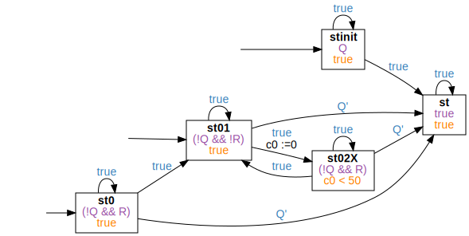
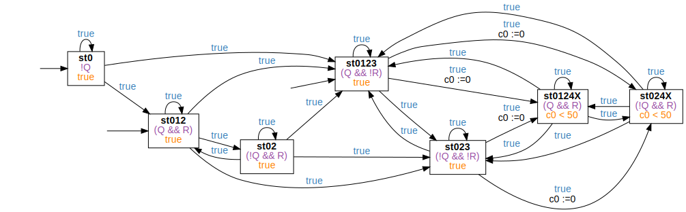

<!-- Auto generated file, do not make any changes here. -->

## MaxDurationPattern

### MaxDurationPattern Globally
```
Globally, it is always the case that once "Q" becomes satisfied, it holds for less than "5" time units
```
```
true;⌈Q⌉ ∧ ℓ ≥ 5;true
```

### MaxDurationPattern Before
```
Before "Q", it is always the case that once "R" becomes satisfied, it holds for less than "5" time units
```
```
⌈!Q⌉;⌈(!Q && !R)⌉;⌈(!Q && R)⌉ ∧ ℓ ≥ 5;true
```

### MaxDurationPattern After
```
After "Q", it is always the case that once "R" becomes satisfied, it holds for less than "5" time units
```
```
true;⌈Q⌉;true;⌈!R⌉;⌈R⌉ ∧ ℓ ≥ 5;true
```

### MaxDurationPattern Between
```
Between "Q" and "R", it is always the case that once "S" becomes satisfied, it holds for less than "5" time units
```
```
true;⌈(Q && !R)⌉;⌈!R⌉;⌈(!R && S)⌉ ∧ ℓ ≥ 5;⌈!R⌉;⌈R⌉;true
```

### MaxDurationPattern AfterUntil
```
After "Q" until "R", it is always the case that once "S" becomes satisfied, it holds for less than "5" time units
```
```
true;⌈(Q && !R)⌉;⌈!R⌉;⌈(!R && S)⌉ ∧ ℓ ≥ 5;true
```

