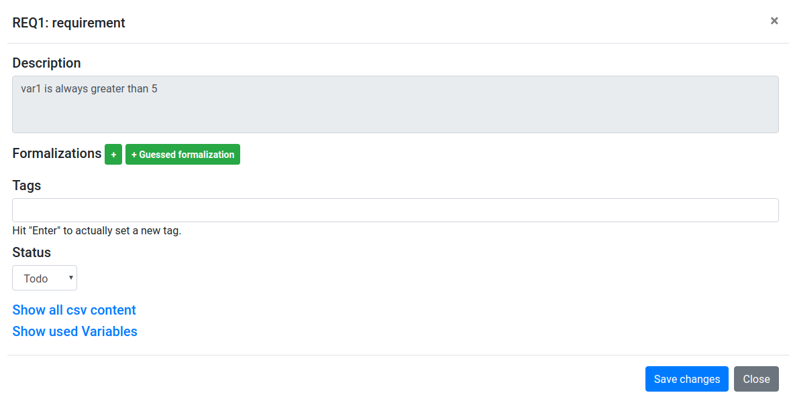

toc_depth: 2

# Workflow

## Example input
The CSV file `example_intput/example_input.csv` contains requirements:
``` bash
ID,Description,Type
META1,This is an example for some requirements,meta
META2,Next we define some requirements,meta
REQ1,var1 is always greater than 5,requirement
REQ2,var2 is always smaller than 10,requirement
REQ3,constraint1 always holds,requirement
REQ4,constraint2 always holds,requirement
REQ5,var1 is always smaller than 5,requirement
REQ6,constraint1 and constraint2 never hold at the same time,requirement
REQ7,if var3 = True then var4 := 1,requirement
REQ8,if var3 = True then var4 := 0,requirement
```
In this case every row consists of the fields `ID`, `Description`, and `Type`.

- `ID` is a unique identifier, 
- `Description` is the description ,
- `Type`, is a type, in this example `meta` or `requirement`, where rows with type `meta` contain some meta-information
and rows with type `requirement` contain actual requirements of the module you want to formalize.

## Start Hanfor
1. Configure Hanfor as explained in [Installation](/installation/installation.html)
2. Start Hanfor: 
``` bash
cd hanfor
python3 app.py -c ../example_input/example_input.csv awesome_tag
```

* `-c example_input.csv` specifies the csv input file we pass.
* `example_tag` is some meaningful tag you want to give this session.

If you start Hanfor later with the same tag, you'll start exactly this session.

Currently the startup of Hanfor is interactive and looks like this:
``` bash
(venv) bree@titan:~/repos/hanfor/hanfor$ python3 app.py -c ../example_input/example_input.csv awesome_tag
2019-10-10 13:55:17,845: [DEBUG]: Enabled logging.
2019-10-10 13:55:17,858: [INFO]: Hanfor starts creating a revision.
2019-10-10 13:55:17,858: [INFO]: No revisions for `awesome_tag`. Creating initial revision.
2019-10-10 13:55:17,858: [INFO]: Load Input : example/example_input.csv
2019-10-10 13:55:17,862: [INFO]: Could not guess .csv dialect, assuming defaults
Select ID header
╔Choices═════════════╗
║ 0    ║ Description ║
║ -> 1 ║ ID          ║
║ 2    ║ Type        ║
╚══════╩═════════════╝
[Choice or Enter for  -> default]> 1
Select requirements description header
╔Choices══════════╗
║ 0 ║ Description ║
║ 1 ║ ID          ║
║ 2 ║ Type        ║
╚═══╩═════════════╝
[Choice or Enter for  -> default]> 0
Select formalization header
╔Choices════════════════════╗
║ 0 ║ Description           ║
║ 1 ║ ID                    ║
║ 2 ║ Type                  ║
║ 3 ║ Add new Formalization ║
╚═══╩═══════════════════════╝
[Choice or Enter for  -> default]> 3
Select type header.
╔Choices══════════╗
║ 0 ║ Description ║
║ 1 ║ ID          ║
║ 2 ║ Type        ║
╚═══╩═════════════╝
[Choice or Enter for  -> default]> 2
```

Alternatively you can directly pass the header definition, using `--header`: 
``` bash
python3 app.py -c example_input/example_input.csv --header='{"csv_id_header": "ID", "csv_desc_header": "Description", "csv_formal_header": "Hanfor_Formalization", "csv_type_header" : "Type"}' awesome_tag
```

you can now reach Hanfor by visiting [http://127.0.0.1:5000](http://127.0.0.1:5000)

<figure markdown="span">
  { loading=lazy }
  <figcaption>Figure 1: Hanfor requirement overview.</figcaption>
</figure>

## Preprocessing
By default, all rows now have the status **Todo**. 
It might be the case that you want to change this for a certain set of rows to another status.

In this example we want to set every row of type `meta` to the status **Done**. 

To accomplish this we use the [Search Query Language](/usage/requirements/#search-in-requirements-table). 

1. In Hanfor, search  `:COL_INDEX_04:meta`. This will search for rows which match "meta" in the 4. coloumn (Type). 
You should now only see the rows of type `meta`.
2. Select all rows by clicking  **All**.
3. Click **Edit selected** and select **Done** in the field **Set status**.
4. Finally, click **Apply changes to selected requirements**

## Formalization
Order your requirement overview by **Pos**, by clicking on the table column.
### REQ1
To formalize this requirement, we click on the ID **REQ1** to open then formalization-modal:

<figure markdown="span">
  { loading=lazy }
  <figcaption>Figure 2: Formalization modal.</figcaption>
</figure>


1. Click on **+** to add a new formalization and then on **..(click to open)**
2. We now have to select a *Scope* and a *Pattern*.
* The scope is **Globally**, because the requirement states that "var1 is **always** greater than 5".
* The pattern is **it is always the case that {R} holds**.
* For **{R}** we insert the condition: `var1 > 5` 
* Set the status to **Review** and then press **save changes**.
If you save a requirement, Hanfor will automatically create the used variables and derive their type.
You can examine and even alter them in the section **Variables**, for the case that Hanfor did not derive a variable-type correctly.

<figure markdown="span">
  { loading=lazy }
  <figcaption>Figure 3: Definition of Scope and Pattern.</figcaption>
</figure>

The same procedure can be applied to REQ2 - REQ6

### REQ7 and REQ8
REQ7 and REQ8 are different.
Consider REQ7: `if var3 = True then var4 := 0`.

* The scope is still **Globally** 
* The pattern is **it is always the case that if "{R}" holds, then "{S}" holds after at most "{T}" time units**, because in a realtime-system a variable assignment does not happen instantly, there can be delays.
* For **{R}** we insert `var3`, because the variable type is boolean.
* For **{S}** insert `var4 == 0`,
* For **{T}** we need a certain amount of time units, for example 50. We do not want to hardcode values, 
we introduce a new variable and insert `MAX_TIME`.

We end up with the following: 
``` 
Globally, it is always the case that if "var3" holds, then "var4 == 0" holds after at most "MAX_TIME" time units.
```
Save the formalization. 

You will now recognize that Hanfor automatically added a new *Tag* **Type_inference_error** to your freshly
formalized requirement. To fix that, to go the **Variables** section and open the `MAX_TIME` variable.
You see that Hanfor derived the type `bool`, but we actually want it to be of type `CONST` as the variable represents time units. Change the type and
also assign a value, for example `50`.

<figure markdown="span">
  { loading=lazy }
  <figcaption>Figure 4: Example for the `MAX_TIME` variable.</figcaption>
</figure>

For REQ8 you should have: 
``` 
Globally, it is always the case that if "var3" holds, then "var4 == 1" holds after at most "MAX_TIME" time units.
```

## Exporting the formalized requirements.
Once you are done with all requirements, it is time to analyze them using a tool like Ultimate (TODO:ref to git).

### Preparing the export.
You might want to filter out some rows, for example, all of type `meta` or all that have a certain tag.
Again, use the [Search Query Language](/usage/requirements/#search-in-requirements-table) to select only the requirements you want.
For example, if we only rows of type `requirement` which are not on status **Todo** we search:

```
:COL_INDEX_04:requirement:AND::COL_INDEX_06::NOT:Todo
```

### Export
To export requirements, press **Tools**, then choose either `.req` or `.csv`.
If you want to analyze the requirements using Ultimate, choose **Generate .req file from (filtered) requirements table**
and then save it.

You should end up with the following:
```
CONST MAX_TIME IS 50.0

Input constraint1 IS bool
Input constraint2 IS bool
Input var1 IS int
Input var2 IS int
Input var3 IS bool
Input var4 IS int


REQ1_0: Globally, it is always the case that "var1 > 5" holds
REQ2_0: Globally, it is always the case that "var2 < 10" holds
REQ3_0: Globally, it is always the case that "constraint1" holds
REQ4_0: Globally, it is always the case that "constraint2" holds
REQ5_0: Globally, it is always the case that "var1 < 5" holds
REQ6_0: Globally, it is never the case that "constraint1 && constraint2 " holds
REQ7_0: Globally, it is always the case that if "var3" holds, then "var4 == 1" holds after at most "MAX_TIME" time units
REQ8_0: Globally, it is always the case that if "var3" holds, then "var4 == 0" holds after at most "MAX_TIME " time units
```

## Analysis using Ultimate.

### Get ReqAnalyzer
First of all you need the [Ultimate](https://github.com/ultimate-pa/ultimate) tool **ReqAnalyzer**.
See how in the [ReqAnalyzer](/installation/installation.html#reqanalyzer) section.


### Perform the complete analysis.
We wrote a script, which perform a complete analysis, including the extraction of relevant information.
The script is located in `UReqCheck-linux`.

- You have to configure `run_complete_analysis.sh`, which is used to run the complete analysis.
The script takes several arguments:
``` bash
run_complete_analysis.sh <req_file> <req_repo_folder> <req_folder> [<rt_inconsistency_range> <timeout_per_assertion>]
```

Where:
* `req_file` is the Requirements file you generated using Hanfor.
* `req_repo_folder` is the path to the repository, which contains the requirements-folder
* `req_folder` is the path to the requirements-folder
* `rt_inconsistency_range` (default: 2) is the amount of requirements which are checked together for RT-inconsistency. 
Careful with this parameter, it will blow up the amount of checks really fast.
* `timeout_per_assertion` (default: 900) The time how long a singles assertion is checked.

### Use Ultimate
Execute the `run_complete_analysis.sh` script.

``` bash
cd /path/to/UReqCheck-linux
./run_complete_analysis.sh path/to/repo/example_input/example_input.req path/to/repo/example_input path/to/repo/example_input
```

This will start Ultimate and run an analysis. The analysis checks for rt-inconsistency and vacuity and logs are be generated: 

* `hanfor/example/example_input.req.log`
* `hanfor/example/example_input.req.testgen.log`
* `hanfor/example/logs/example_input/example_input.req.relevant.log`
* `hanfor/example/logs/example_input/example_input.req.testgen.log`

### Evaluate

In `hanfor/example/example_input.req.log` we can see that Ultimate reports: 
```
 --- Results ---
 * Results from de.uni_freiburg.informatik.ultimate.pea2boogie:
  - RequirementInconsistentErrorResult: Requirements set is inconsistent.
    Requirements set is inconsistent. Some invariants are already infeasible. Responsible requirements: REQ6_0, REQ3_0, REQ4_0
```

Now, if we investigate REQ3, REQ4 and REQ6:

``` 
REQ3_0: Globally, it is always the case that "constraint1" holds
REQ4_0: Globally, it is always the case that "constraint2" holds
REQ6_0: Globally, it is never the case that "constraint1 && constraint2 " holds
```
We directly see what the problem is: On one hand, our invariants demand that `constraint1` and `constraint2` always holds,
but on the other hand there is another invariant which demands that `constraint1` and `constraint2` never hold at the same time.
Think about this as:
```
constraint1 && constraint2 && ((constraint1 && !constraint2) || (!constraint1 && constraint2))
```
this is clearly unsatisfiable.

### Alter your requirements
We found an inconsistency in our requirements, that has to be fixed. 
Let's assume you review your requirements and you recognize `REQ4` was defined wrong in the csv,
where `REQ4,constraint2 always holds,requirement` should be `REQ4,constraint2 never holds,requirement`.
While reading over the requirements, you also recognize that `REQ1` and `REQ5` collide and you find out that `REQ5` shall be deleted.

When we apply this changes, we end up with the following changes: 

 - Alter `REQ4,constraint2 always holds,requirement` to `REQ4,constraint2 never holds,requirement`
 - Remove `REQ5`
 
and our csv file now looks as follows: 

``` bash
ID,Description,Type
META1,This is an example for some requirements,meta
META2,Next we define some requirements,meta
REQ1,var1 is always greater than 5,requirement
REQ2,var2 is always smaller than 10,requirement
REQ3,constraint1 always holds,requirement
REQ4,constraint2 never holds,requirement
REQ6,constraint1 and constraint2 never hold at the same time,requirement
REQ7,if var3 = True then var4 = 0,requirement
REQ8,if var3 = True then var4 = 1,requirement
```

### Time for a new revision.
We altered our requirements, we now need to create a new revision in Hanfor and change our formalizations.
Execute: 

``` bash
cd hanfor
python3 app.py -r -c example/example_input.csv example_tag
```

- Hanfor will then ask: **"Which revision should I use as a base?"**,
we choose `revision_0` (as it is the only one, usually you want your latest revision).

- Then, Hanfor asks **Should I use the csv header mapping from base revision?**,
as we did not change the csv header, we just keep the current one.

A quick recap what happens when creating a revision:
* New requirements get the tag `revision_0_to_revision_1_new_requirement`
* Changed requirements get the tag `revision_0_to_revision_1_data_changed` and `revision_0_to_revision_1_description_changed`
* Requirements where the formalization migrated to the new revision get the tag `revision_0_to_revision_1_migrated_formalized`

We now have to alter the requirements which have changed, that's only `REQ4`. 
Open the formalization of `REQ4` and correct it to `Globally, it is never the case that "constraint2" holds`.

### Ultimate Analysis #2
1. Export your requirements as before with the name `example_input_revision1.req`
2. Run Ultimate on the new requirements file.

You can now examine the log created in `hanfor/example/logs/example_input/example_input.req.relevant.log`,
which contains the following:
``` 
- ReqCheckFailResult [Line: -1]: Requirements REQ8_0, REQ7_0 are rt-inconsistent
```

A `ReqCheckFailResult` usually implies that something is broken, 
Ultimate found that requirements `REQ7` and `REQ8` are rt-inconsistent, let's analyze this result:

``` 
REQ7,if var3 = True then var4 = 0,requirement
REQ8,if var3 = True then var4 = 1,requirement
```

These two requirements collide, because they assign different values to `var4` when `var3` holds.
This is especially bad in a realtime system, because it can happen that `var4 == 0` holds after a certain amount of time, 
and `var4 == 1` holds at a later point of time or vice versa. Why is this bad? - because it can cause unexpected behaviour when a change propagates through the system.


### Conclusion
You are now able to:
 
 1. Setup hanfor, 
 2. Formalize requirements, 
 3. Filter requirements, 
 4. Export them to a .req file
 5. Run Ultimate on a .req file
 6. Interpret the results of Ultimate
 7. Create new revisions in hanfor to fix mistakes in requirements.
